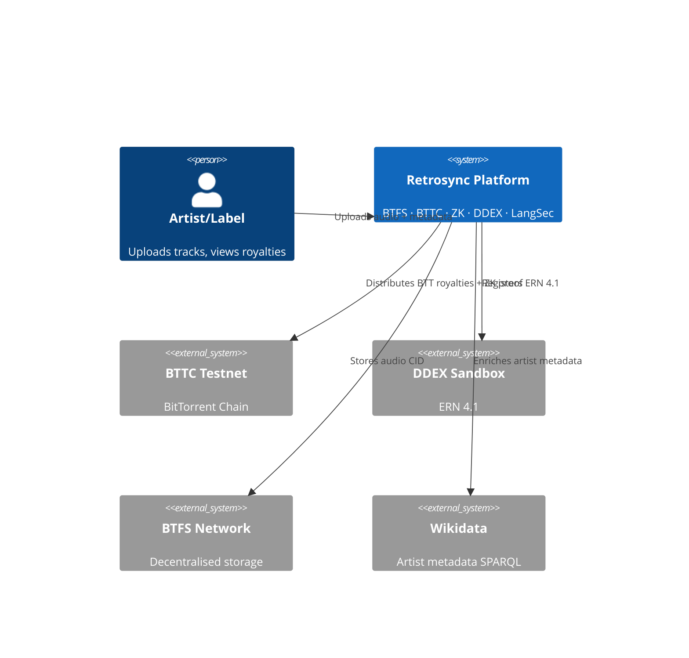

# Retrosync Media Group — C4 Architecture

## System Context

## Business Units
- **Retrosync Platform** — distribution + ZK royalties
- **Retrosync Records** — A&R
- **Retrosync Publishing** — sync licensing
